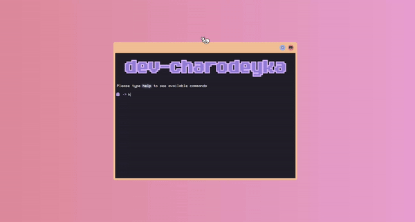

## Preview of Svelte App that emulates Terminal behaviour:

## Article on Medium with Step by step guide on how to build a Terminal Inspired Personal Website Using Svelte, JavaScript, and Tailwind CSS
https://medium.com/@dev-charodeyka/building-a-terminal-inspired-personal-website-using-svelte-javascript-and-tailwind-css-101bbb1ff817

## This App is hosted on Netlify and available here:
https://terminal-like-personal-website.netlify.app/
